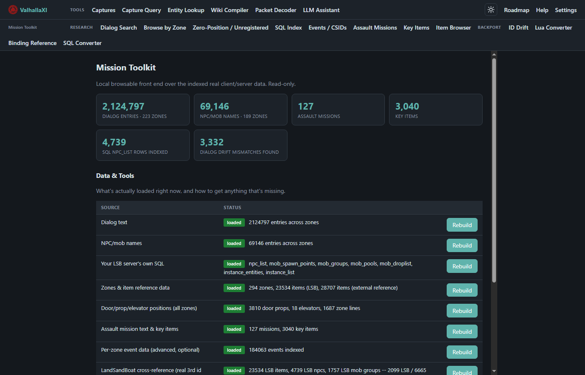
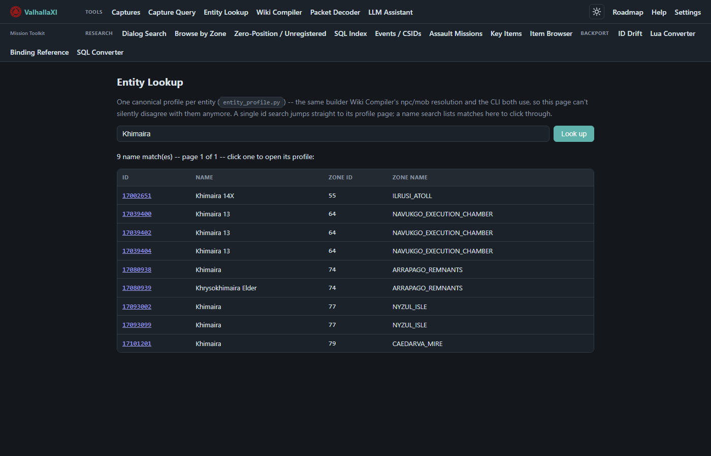
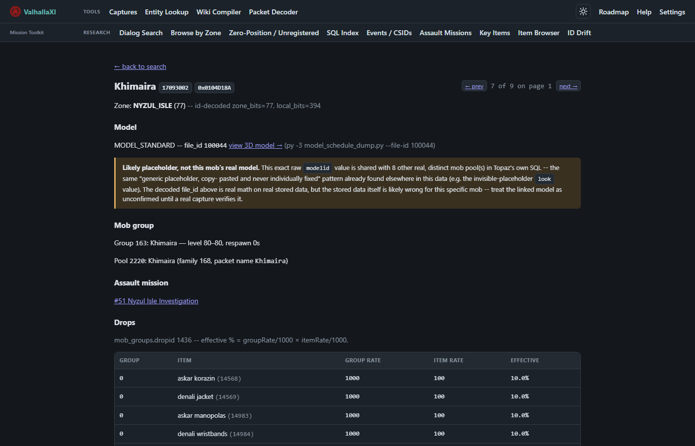
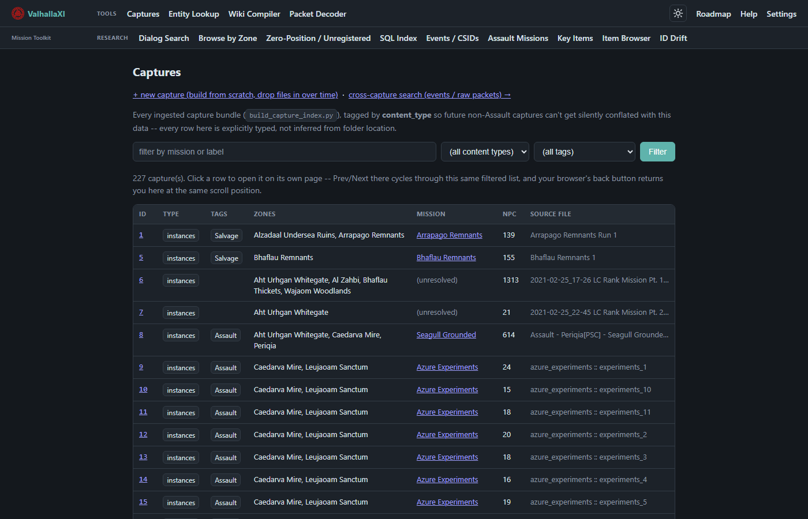
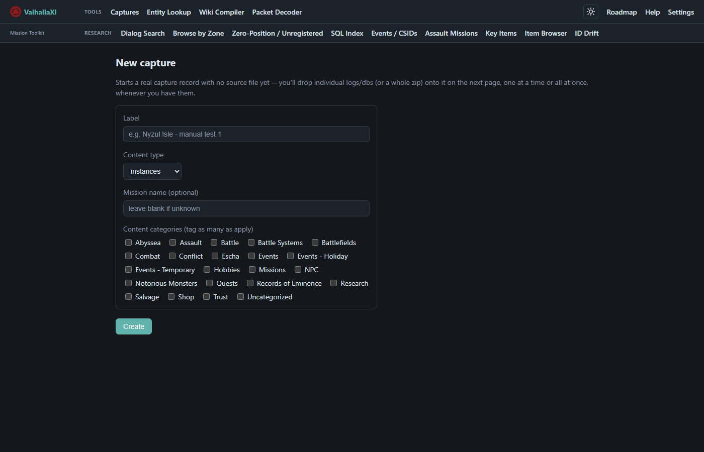
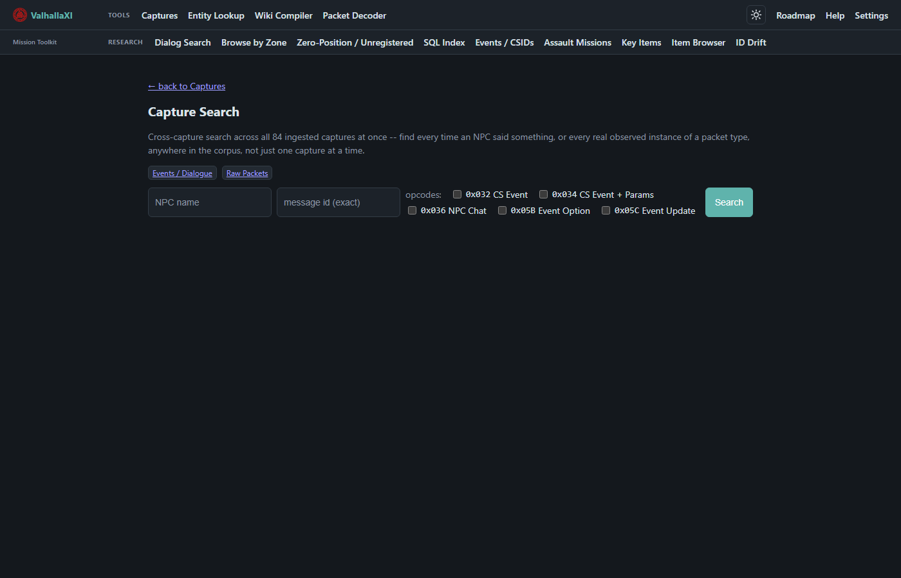

# FFXI Mission Toolkit

A local, browser-based research tool for FFXI private server development (built against
[Topaz](https://github.com/project-topaz/topaz)). It indexes real data straight from your FFXI
client install and your Topaz server checkout — dialog text, NPC/mob names, zone geometry,
mission/key item data, SQL tables, and a cross-reference against
[LandSandBoat](https://github.com/LandSandBoat/LandSandBoat) — into one searchable local database,
with a web UI over the top. Read-only: it never writes to your client or your server.

Built to answer "what's the real id for X" and "what does the client actually say here" without
digging through raw DAT files or SQL dumps by hand.

## Features

- **Dialog Search** — full-text search across every zone's real dialog table.
- **Entity Lookup** — one canonical profile per NPC/mob id: model, spawn group, mission, real drop
  table, cross-zone name matches.
- **Browse by Zone** — every NPC/mob/dialog entry for a single zone at a glance.
- **SQL Index / ID Drift** — your Topaz server's own SQL indexed and diffed against LandSandBoat,
  to catch id mismatches between the two.
- **Events / CSIDs** — per-zone event data, decoded on first view and cached after.
- **Captures** — ingest and browse real packet-capture sessions (multiple capture tool formats
  supported) alongside everything else.
- **Wiki Compiler** — cross-references BG Wiki against the indexed real data.
- **Packet Decoder** — inspect raw packet bytes against a documented opcode table.
- **Assault Missions / Key Items / Zero-Position audit** — a few more focused lookup pages, all
  built on the same indexed data.

## Screenshots


*Homepage — what's loaded, real counts, one-click rebuild per data source.*


*Entity Lookup — searching "Khimaira" surfaces every real copy across every zone.*


*Entity profile — model, mob group/level, mission, and real (decoded) drop table for one id.*


*Captures — every ingested capture session, filterable by mission/tag/content type.*


*Capture New — start a record, then drop logs/DBs onto it as you get them.*


*Capture Search — full-text search across every capture's events and raw packets at once.*

## Dependencies

- **Python 3.11+**
- **A legally-owned FFXI client install** (reads dialog/entity/event data directly from your own
  DAT files — no game data is bundled in this repo)
- **A Topaz server checkout** (reads your own `conf/map.conf` and SQL)
- [`xi-tinkerer`](https://github.com/InoUno/xi-tinkerer) / `xi-tinkerer-py` — DAT parsing, installed
  automatically by setup
- A handful of smaller third-party tools bundled as subfolders (dat extraction, resource
  parsing/building, packet capture) — see [`TOOLING_OVERVIEW.md`](docs/guides/TOOLING_OVERVIEW.md) for the
  full list. Each keeps its own license in its own folder (see **License** below).

## Setup

1. Install Python 3.11+ from [python.org](https://www.python.org/downloads/) — check **"Add
   python.exe to PATH"** during install.
2. Double-click **`setup.bat`**.
3. Enter your FFXI client path (the folder with `FFXiMain.dll`) and your Topaz server path (the
   folder with `conf\map.conf`) when asked.
4. It installs dependencies and builds everything — the zone database, dialog/NPC index, your
   Topaz server's SQL index, and the LandSandBoat cross-reference. First run takes a while (some
   of this reads every zone in the game); later runs are instant.
5. It opens automatically at **http://127.0.0.1:8420**.

Full detail, including how to rebuild individual pieces later, is in [`SETUP.md`](docs/guides/SETUP.md).

## Build & Run

There's no separate build step — `setup.bat` both builds the data and starts the server. After
first-time setup, just run:

```bat
start.bat
```

Any data source can be rebuilt individually from its own **Rebuild** button on the homepage (e.g.
after editing your Topaz server's scripts, or when upstream LandSandBoat/BG Wiki data changes) —
no command line needed for normal use.

## License

This repo's own code (the Python toolkit and web UI) is released under the [MIT License](LICENSE).

Several bundled third-party tools carry **their own** licenses in their own subfolders — most
notably GPL-3.0 (`xi-model-viewer`, `Packetlyzer`) and AGPL-3.0 (`xi-tinkerer`). Those licenses
apply to those tools specifically, not to this repo's own code, and their `LICENSE` files are kept
intact as shipped. If you redistribute this repo, keep those subfolders' licenses with them.

No FFXI game data (DAT files, extracted text, models, etc.) is included in this repo — the setup
process reads it from your own legally-owned client install.
